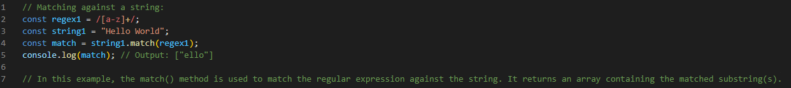
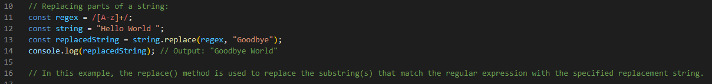

# Regex Tutorial

This tutorial will give a brief insight about the usefullness of regular expressions (regex) in Java

## Summary

A regular expression (also refered as regex) is a way to describe a pattern. It defines a search pattern for strings. The search pattern can be anything from a simple character, a fixing string or a complex expression containing special characters describing the pattern. Simply a regex can be used to search, edit and manupulate text/strings. 

Regular expressions can be used to perform all types of text search and text replace operations. It is used to locate or validate specific strings or patterns of text in a sentence, document, or any other character input. Regular expressions use both basic and special characters.Java does not have a built-in Regular Expression class, but we can import the java.util.regex package to work with regular expressions.

Below are two examples for using regex in Matching a string  and Replacing part of a string:

## Table of Contents

- [Regex Tutorial](#regex-tutorial)
  - [Summary](#summary)
  - [Table of Contents](#table-of-contents)
  - [Regex Components](#regex-components)
    - [Anchors](#anchors)
    - [Quantifiers](#quantifiers)
    - [The range {n,m}](#the-range-nm)
    - [Shorthand’s](#shorthands)
      - [+](#)
      - [?](#-1)
      - [\*](#-2)
    - [Grouping Constructs](#grouping-constructs)
    - [Bracket Expressions](#bracket-expressions)
    - [Character Classes](#character-classes)
    - [The OR Operator](#the-or-operator)
    - [Flags](#flags)
    - [Character Escapes](#character-escapes)
  - [Author](#author)

## Regex Components

### Anchors

In regular expressions, an anchor is a metacharacter that asserts a particular position in the input text. Anchors have special meaning in regular expressions. They do not match any character. Instead, they match a position before or after characters:

•	 ^ – The caret anchor matches the beginning of the text.
•	 $ – The dollar anchor matches the end of the text.

See the following snippet examples for both the expressions:

Anchor ^
let str = 'AnthonyG';
console.log(/^A/.test(str));

Output:  true

Anchor $
let str = 'AnthonyG';
console.log(/G$/.test(str));

Output:  true

### Quantifiers

Quantifiers in regular expressions match a number of instances of a character, group, or character class in a string. They allow you to define the quantity of characters that you want to match. 
In Java's regular expressions, the following quantifiers are commonly used:
Exact count {n}
A number in curly braces {n}is the simplest quantifier. When you append it to a character or character class, it specifies how many characters or character classes you want to match.
Example snippet: 
let str = 'Bootcamp 2023';
let re = /\d{4}/;

let result = str.match(re);

console.log(result);
Output:
[2023]

### The range {n,m}
The range matches a character or character class from n to m times.
For example, to find numbers that have two, three, or four digits, you use the regular expression /\d{2,4}/g:

Example snippet: 
let str = 'I am in the bootcamp of July31 2023';
let re = /\d{2,4}/g;

let result = str.match(re);
console.log(result);
Output:
[ '31', '2023' ]

### Shorthand’s
#### +
The shorthand as ‘+’. is a shorthand character that represents "one or more occurrences of the preceding character or group. 
Example snippet: 
The \d+ searches for numbers:
let phone = "+1-(613)-123-4567";
let result = phone.match(/\d+/g);

console.log(result);
Output:
[ '1', '613', '123', '4567' ]

#### ?
The quantifier ‘?’ is a shorthand character that represents "zero or one occurrence of the preceding character or group. means zero or one. It is the same as {0,1}.
Example snippet: 
Colou?r will match both color and Colour:
let str = 'Is this color or colour?';
let result = str.match(/colou?r/g);

console.log(result);
Output:
[ 'color', 'colour' ]

#### *
The quantifier * means zero or more occurrences of the preceding character or group 
Example snippet: 
The following example shows how to use the quantifier * to match the string “John” followed by any word character:
let str = 'Jason was not JasonX the killer';
let re = /Jason\w*/g

let results = str.match(re);

console.log(results);
Output:
[ 'Jason', 'JasonX']

### Grouping Constructs

Grouping constructs in regex allow you to treat multiple characters as a single unit This is achieved using parentheses () to create a capturing or non-capturing group. The primary way you group a section of a regex is by using parentheses (()). Each section within parentheses is known as a subexpression.  (Ex. (abc):(dswg)). As regular expressions grow more complicated, you may check multiple parts of a string to determine that different sections fulfill different requirements. To break these sections up, you'll need to use grouping constructs.

For an example the below contains two grouping constructs or subexpressions:

((abc):(dswg))

The first subexpression is looking for a part of the string that matches the string "abc" exactly. Similarly, the second subexpression is looking for "dswg". In between the subexpressions, we have a colon (:). Thus, the string "abc:dswg" would match, but the string "acb:dswg" would not. Unlike bracket expressions, subexpressions look for an exact match unless they're told to do otherwise.

### Bracket Expressions

Bracket expressions, also known as character classes, are a set of components of regex that can match a single character at that position in the input text. In regex, bracket expressions are enclosed in square brackets []. Here are some examples of using bracket expressions in regex:

•	[abc]: Matches any single character that is either 'a', 'b', or 'c'.
•	[0-9]: Matches any single digit from 0 to 9.
•	[a-zA-Z]: Matches any single uppercase or lowercase letter.
•	[^abc]: Matches any single character that is not 'a', 'b', or 'c'.

These examples demonstrate the use of bracket expressions in regex to define character classes for matching specific characters or ranges of characters. Adjust the patterns based on your specific requirements.

### Character Classes

In regular expressions, character classes are used to match any one character from a set of characters. A character class allows you to match any symbol from a certain character set. A character class is also called a character set.

Suppose that you have a phone number like this: +1-(613)-123-4567 and you want to turn it into a plain number 16131234567.
Character classes in regular expressions can help you to do this.

Code snippet:

let phone = '+1-(613)-123-4567';
let re = /\d/g;

let numbers = phone.match(re);
let phoneNo = numbers.join('');

console.log(phoneNo);

Output:
16131234567

### The OR Operator

### Flags

### Character Escapes

## Author

A short section about the author with a link to the author's GitHub profile (replace with your information and a link to your profile)
