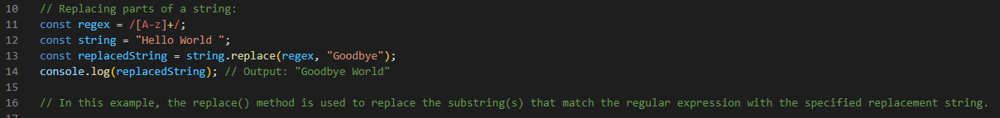

# Regex Tutorial

This tutorial will give a brief insight about the usefullness of regular expressions (regex) in Java

## Summary

A regular expression (also refered as regex) is a way to describe a pattern. It defines a search pattern for strings. The search pattern can be anything from a simple character, a fixing string or a complex expression containing special characters describing the pattern. Simply a regex can be used to search, edit and manupulate text/strings. 

Regular expressions can be used to perform all types of text search and text replace operations. It is used to locate or validate specific strings or patterns of text in a sentence, document, or any other character input. Regular expressions use both basic and special characters.Java does not have a built-in Regular Expression class, but we can import the java.util.regex package to work with regular expressions.

Below are two examples for using regex in Matching a string  and Replacing part of a string:

// // Matching against a string:
// const regex1 = /[a-z]+/;
// const string1 = "Hello World";
// const match = string1.match(regex1);
// console.log(match); // Output: ["ello"]

// In this example, the match() method is used to match the regular expression against the string. It returns an array containing the matched substring(s).

// Replacing parts of a string:
// const regex = /[A-z]+/;
// const string = "Hello World ";
// const replacedString = string.replace(regex, "Goodbye");
// console.log(replacedString); // Output: "Goodbye World"

As stated above in the first code snipped, we can use the regex to validate the user input for the email. We can verify whether it contains the '@' and '.' signs. Also to validate the input against any unacceptable sysmbols. 

Below is a sample string variable which can be used for this validation:

String regex = "^[a-zA-Z0-9_+&*-]+(?:\\.[a-zA-Z0-9_+&*-]+)*@(?:[a-zA-Z0-9-]+\\.)+[a-zA-Z]{2,7}$";

## Table of Contents

- [Regex Tutorial](#regex-tutorial)
  - [Summary](#summary)
  - [Table of Contents](#table-of-contents)
  - [Regex Components](#regex-components)
    - [Anchors](#anchors)
    - [Quantifiers](#quantifiers)
    - [The range {n,m}](#the-range-nm)
    - [Shorthand’s](#shorthands)
      - [+](#)
      - [?](#-1)
      - [\*](#-2)
    - [Grouping Constructs](#grouping-constructs)
    - [Bracket Expressions](#bracket-expressions)
    - [Character Classes](#character-classes)
    - [The OR Operator](#the-or-operator)
    - [Flags](#flags)
    - [Character Escapes](#character-escapes)
  - [Author](#author)
        - [Reference:](#reference)

## Regex Components

### Anchors

In regular expressions, an anchor is a metacharacter that asserts a particular position in the input text. Anchors have special meaning in regular expressions. They do not match any character. Instead, they match a position before or after characters:

•	 ^ – The caret anchor matches the beginning of the text.
•	 $ – The dollar anchor matches the end of the text.

See the following snippet examples for both the expressions:

Anchor ^
let str = 'AnthonyG';
console.log(/^A/.test(str));

Output:  true

Anchor $
let str = 'AnthonyG';
console.log(/G$/.test(str));

Output:  true

### Quantifiers

Quantifiers in regular expressions match a number of instances of a character, group, or character class in a string. They allow you to define the quantity of characters that you want to match. 
In Java's regular expressions, the following quantifiers are commonly used:
Exact count {n}
A number in curly braces {n}is the simplest quantifier. When you append it to a character or character class, it specifies how many characters or character classes you want to match.

Example snippet: 

let str = 'Bootcamp 2023';
let re = /\d{4}/;

let result = str.match(re);

console.log(result);
Output:
[2023]

### The range {n,m}

The range matches a character or character class from n to m times.
For example, to find numbers that have two, three, or four digits, you use the regular expression /\d{2,4}/g:

Example snippet: 
let str = 'I am in the bootcamp of July31 2023';
let re = /\d{2,4}/g;

let result = str.match(re);
console.log(result);
Output:
[ '31', '2023' ]

### Shorthand’s
#### +
The shorthand as ‘+’. is a shorthand character that represents "one or more occurrences of the preceding character or group. 
Example snippet: 
The \d+ searches for numbers:
let phone = "+1-(613)-123-4567";
let result = phone.match(/\d+/g);

console.log(result);
Output:
[ '1', '613', '123', '4567' ]

#### ?
The quantifier ‘?’ is a shorthand character that represents "zero or one occurrence of the preceding character or group. means zero or one. It is the same as {0,1}.
Example snippet: 
Colou?r will match both color and Colour:
let str = 'Is this color or colour?';
let result = str.match(/colou?r/g);

console.log(result);
Output:
[ 'color', 'colour' ]

#### *
The quantifier * means zero or more occurrences of the preceding character or group 
Example snippet: 
The following example shows how to use the quantifier * to match the string “John” followed by any word character:
let str = 'Jason was not JasonX the killer';
let re = /Jason\w*/g

let results = str.match(re);

console.log(results);
Output:
[ 'Jason', 'JasonX']

We can use the above regex componenents to validate the user's email input as in the below snippet:

function validateEmail(email) {
  const regex = /^([a-z0-9_\.-]+)@([\da-z\.-]+)\.([a-z\.]{2,6})$/;
  return regex.test(email);
}

const email1 = "test@example.com";
const email2 = "invalid_email";
console.log(validateEmail(email1)); // Output: true
console.log(validateEmail(email2)); // Output: false

In this code, the validateEmail function takes an email string as input and uses the test method of the regular expression object to check if the email matches the pattern defined by the regular expression. The ^ anchor is used at the beginning of the regular expression, and the $ anchor is used at the end, ensuring that the entire string is validated.

### Grouping Constructs

Grouping constructs in regex allow you to treat multiple characters as a single unit This is achieved using parentheses () to create a capturing or non-capturing group. The primary way you group a section of a regex is by using parentheses (()). Each section within parentheses is known as a subexpression.  (Ex. (abc):(dswg)). As regular expressions grow more complicated, you may check multiple parts of a string to determine that different sections fulfill different requirements. To break these sections up, you'll need to use grouping constructs.

For an example the below contains two grouping constructs or subexpressions:

((abc):(dswg))

The first subexpression is looking for a part of the string that matches the string "abc" exactly. Similarly, the second subexpression is looking for "dswg". In between the subexpressions, we have a colon (:). Thus, the string "abc:dswg" would match, but the string "acb:dswg" would not. Unlike bracket expressions, subexpressions look for an exact match unless they're told to do otherwise.

To validate an email address using regular expressions, you can use grouping constructs. Here's an example of how you can use grouping constructs to validate an email address:

/^([a-z0-9_\.-]+)@([\da-z\.-]+)\.([a-z\.]{2,6})$/

Let's break down the regex and explain the grouping constructs used:

^ - Matches the start of the string.

( - Begins the first capturing group.

[a-z0-9_\.-]+ - Matches one or more lowercase letters, digits, underscores, dots, or hyphens.

) - Ends the first capturing group.

@ - Matches the "@" symbol.

( - Begins the second capturing group.

[\da-z\.-]+ - Matches one or more digits, lowercase letters, dots, or hyphens.

) - Ends the second capturing group.

\. - Matches a dot.

( - Begins the third capturing group.

[a-z\.]{2,6} - Matches two to six lowercase letters or dots.

) - Ends the third capturing group.

$ - Matches the end of the string.

The grouping constructs are used to create capturing groups, which allow you to extract specific parts of the matched string. In this case, the first capturing group captures the local part of the email address (before the "@" symbol), the second capturing group captures the domain name, and the third capturing group captures the top-level domain.

### Bracket Expressions

Bracket expressions, also known as character classes, are a set of components of regex that can match a single character at that position in the input text. In regex, bracket expressions are enclosed in square brackets []. Here are some examples of using bracket expressions in regex:

•	[abc]: Matches any single character that is either 'a', 'b', or 'c'.
•	[0-9]: Matches any single digit from 0 to 9.
•	[a-zA-Z]: Matches any single uppercase or lowercase letter.
•	[^abc]: Matches any single character that is not 'a', 'b', or 'c'.

These examples demonstrate the use of bracket expressions in regex to define character classes for matching specific characters or ranges of characters. Adjust the patterns based on your specific requirements.

### Character Classes

In regular expressions, character classes are used to match any one character from a set of characters. A character class allows you to match any symbol from a certain character set. A character class is also called a character set.

Suppose that you have a phone number like this: +1-(613)-123-4567 and you want to turn it into a plain number 16131234567.
Character classes in regular expressions can help you to do this.

Code snippet:

let phone = '+1-(613)-123-4567';
let re = /\d/g;

let numbers = phone.match(re);
let phoneNo = numbers.join('');

console.log(phoneNo);

Output:
16131234567

To validate an email address using regular expressions, you can use character classes. Here's an example of how you can use character classes to validate an email address:

/^([a-zA-Z0-9._%+-]+)@([a-zA-Z0-9.-]+)\.([a-zA-Z]{2,})$/

The character classes [a-zA-Z0-9._%+-] and [a-zA-Z0-9.-] are used to match valid characters in the local part and domain part of the email address, respectively. The character class [a-zA-Z] is used to match valid characters in the top-level domain.

### The OR Operator

In regular expressions, the OR operator is represented by the pipe | character. It allows you to match either one pattern or another. 
For example, if you want to match either "man" or "women", you can use the regex pattern "man|women". This pattern will match either "man" or "women" in the input string.

Code snippet:

const regex = /man|women/;
const input = "Jack is a great man who won an award.";
console.log(regex.test(input)); 

Output:
true

Note that the OR operator matches the first pattern that it finds. If you want to match multiple occurrences of the patterns, you can use the global flag /g in JavaScript. For example, /man|women/g will match all occurrences of "man" or "women" in the input string.

### Flags

In regular expressions, flags are used to modify the behavior of the pattern matching. These flags are used to control aspects such as case sensitivity, multiline mode, and others.

Few flags used in regex in java include:

•	i (case-insensitive): This flag allows the pattern to match both uppercase and lowercase letters. For example, the pattern /hello/i will match "hello", "Hello", "HELLO", and so on.

•	g (global): This flag allows the pattern to match multiple occurrences in a string. For example, the pattern /a/g will match all occurrences of the letter "a" in a string.

•	m (multiline): This flag allows the pattern to match across multiple lines. It affects the behavior of the ^ and $ anchors. For example, the pattern /^hello/m will match "hello" at the beginning of each line in a multiline string.

### Character Escapes

In regular expressions, character escapes are used match special characters or to give them a different meaning in regex or to match characters that might be difficult to represent directly. Character escapes are typically prefixed with a backslash \. 

Here are some common character escapes in regular expressions: most of the below expressions was used in above code snippets.

•	\d: Matches any digit character (0-9).
•	\w: Matches any word character (alphanumeric character or underscore).
•	\s: Matches any whitespace character (space, tab, newline).
•	\D: Matches any non-digit character.
•	\W: Matches any non-word character.
•	\S: Matches any non-whitespace character.
•	.: Matches a literal period (dot) character. The backslash is used to escape the special meaning of the dot in regular expressions.
•	****: Escapes a special character, allowing it to be treated as a literal character. 

These are just a few examples of character escapes that can be used in regular expressions.

## Author

•	Name: Anthony Gooneratne.
•	GIThub Username: anthogr45
•	email: anthony.dswg@gmail.com
•	GIThub Repo URL : https://github.com/anthogr45

##### Reference:
 https://www.javascripttutorial.net/, https://developer.mozilla.org/, https://docs.github.com, https://bootcampspot.instructure.com/ Xpert Learning Assistance - NEW! and  ChatGPT